## Framework Oriented Programming
#### _@pepibumur_ / _pepibumur@gmail.com_

---

## Hi! :wave:
# __Pedro__

### iOS Developer at SoundCloud
### _@pepibumur_
### _Twitter/GitHub_
#### [www.ppinera.es](http://www.ppinera.es)

---

## Context
## Motivation
## How
## Questions
## Downsides

---


^ I would like to start this talk with a very simple question.
^ How many of you know what that thing is?
^ The answer is as simple as the question.
^ It's a box

---

## _Things with something_
## in common

^ We use boxes in our lives to collect/save things that have something in common.

---

# 💌📷🗒

^ Some examples of these things could be love letters, photos, diaries, notes.

---


^ However we're developers, we don't work with these sort of things.
^ You don't code love letters, or save photos in code.

---


^ In a daily basis we work with source code.
^ Headers, body files, Swift files.
^ Any kind of file that represents business logic written in any language.

---

## ~~Boxes~~
## _Frameworks_

^ Our boxes, where we save the source code and things that have something in common are Frameworks.

---


In computer science, a framework is a _collection_ of implementations of _behavior_, written in terms of a _language_, that has a _well-defined interface_ by which the behavior is invoked
__Wikipedia__

---

# External
# _Frameworks_

^ We usually use them from external sources.
^ We use tools, known as dependency managers that are responsible of resolving the dependencies tree and provide you with these framework that you can link from your app.

---

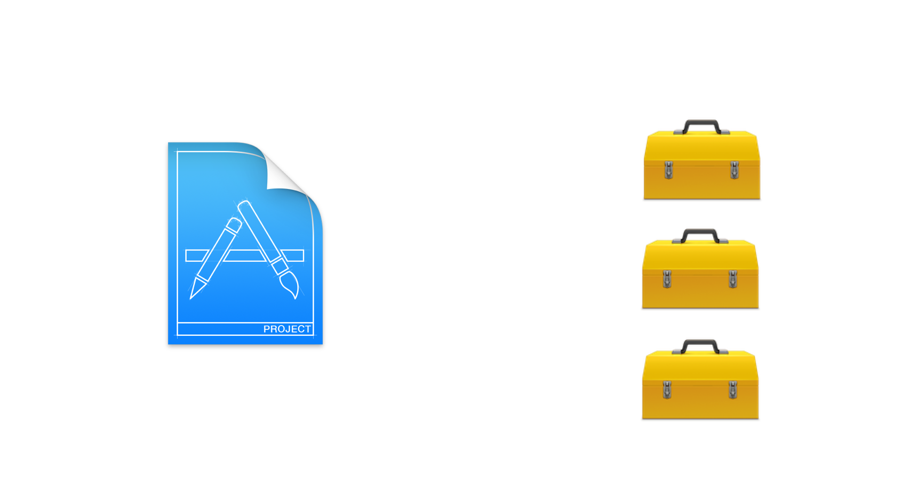

^ Rubygems and NPM are two examples of dependency managers for the Ruby and the Javascript community.
^ If you're a Cocoa developer the most used dependency tools in the community are CocoaPods and Carthage.

---

```ruby
inhibit_all_warnings!
use_frameworks!

target 'MyApp' do
  pod "PureLayout"
  pod 'FLEX'
  pod 'DateTools'
  pod 'Reachability'
  pod 'RxSwift'
  pod 'SDWebImage'
  pod "SDVersion"
  pod 'BlocksKit'
  pod 'CTFeedback'
  pod 'TOWebViewController'
  pod '1PasswordExtension'
  pod 'SlackTextViewController'
  pod 'FeedbackMe'
  pod 'Localize-Swift'
  pod 'Smooch'
  pod 'Fabric'
  pod 'Crashlytics'
  pod 'CWStatusBarNotification'
  pod "ImagePickerSheetController"
  pod 'KYNavigationProgress'
end
```

^ This is an example of a Podfile where we specify all the external dependencies that we want to link our app against to.

---

# :apple:
## _1 app target_
### +
## X External frameworks

^ Most of projects nowadays are based on one target with multiple external dependencies.

---

## _Simple_
## _projects_


^ Pet projects
^ Few source files
^ Extensive use of external dependencies

---

## Small teams
### __(and not distributed)__<br><br>

^ Less than 10 people.
^ Working in a monolithic project.
^ Working in the project is a pleasure.

---

## Only 1-2 platforms<br><br>
# 🖥 :iphone:

^ Few years ago, few platforms

---

# :apple:

^ Big change in the market from Apple
^ Introduced new members to the family.

---

## New platforms <br><br>
## 🖥📱⌚️📺

^ Currently 4 platforms
^ More coming

---

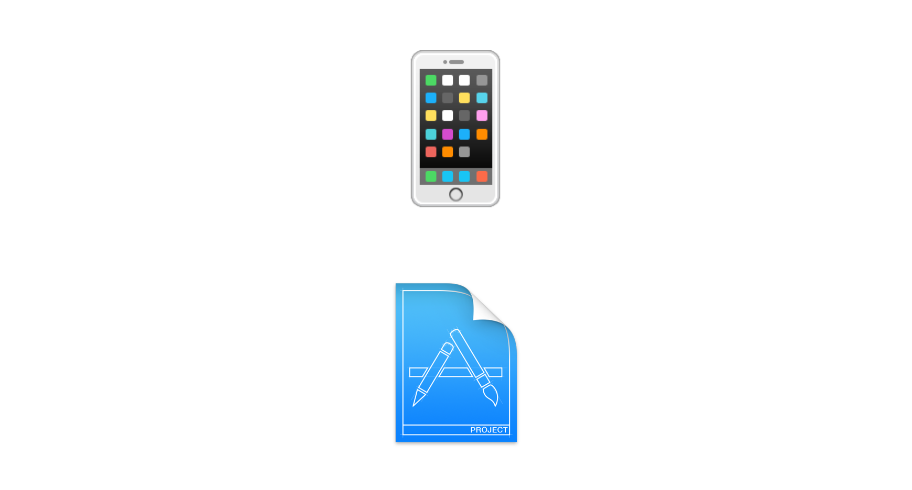

---


---

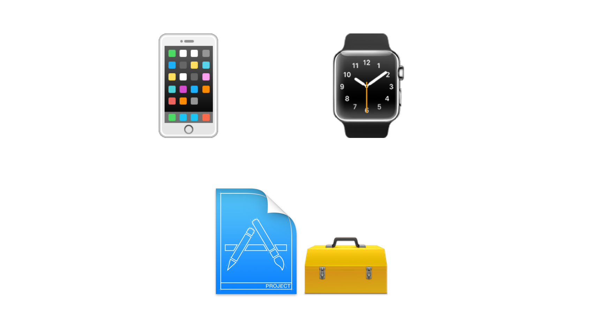

---

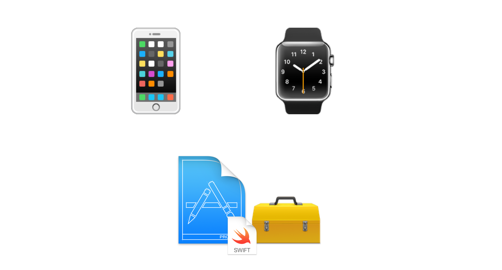

---

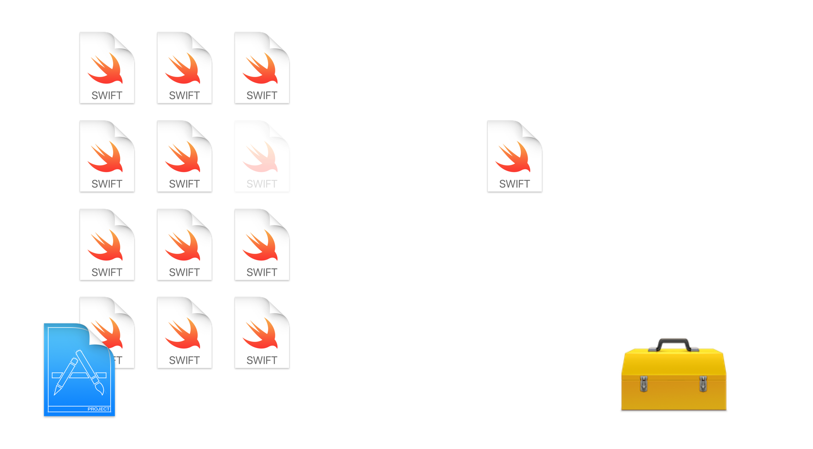

---


---


---


---


---


---

## ~~Simple~~ complex
## _projects_


---

### Couldn't
## reuse code
## scale easily

^ Pain in the ass
^ Copying files between targets didn't scale.

---

## Bigger projects
## Bigger teams
#### __(and also distributed)__

^ SoundCloud is distributed

---

# Conflicts
## Between teams
#### __(Interdependencies)__

---


---


---

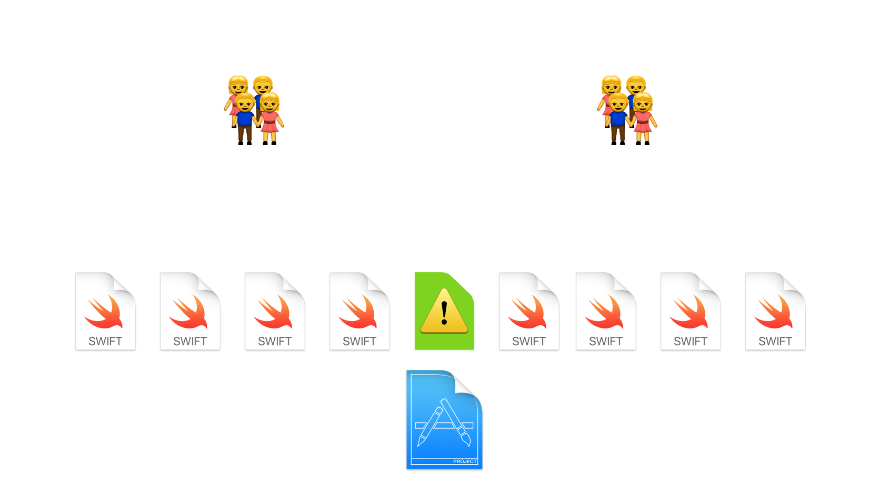

---

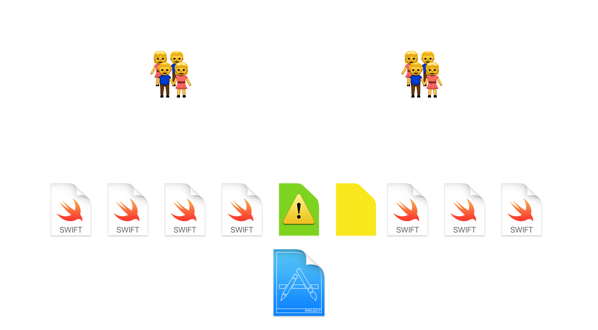

---

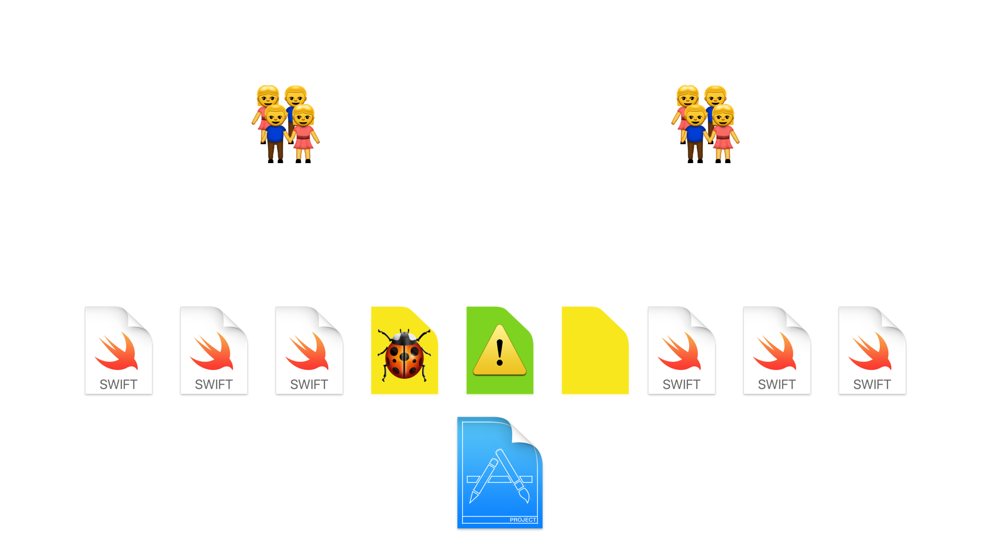

---

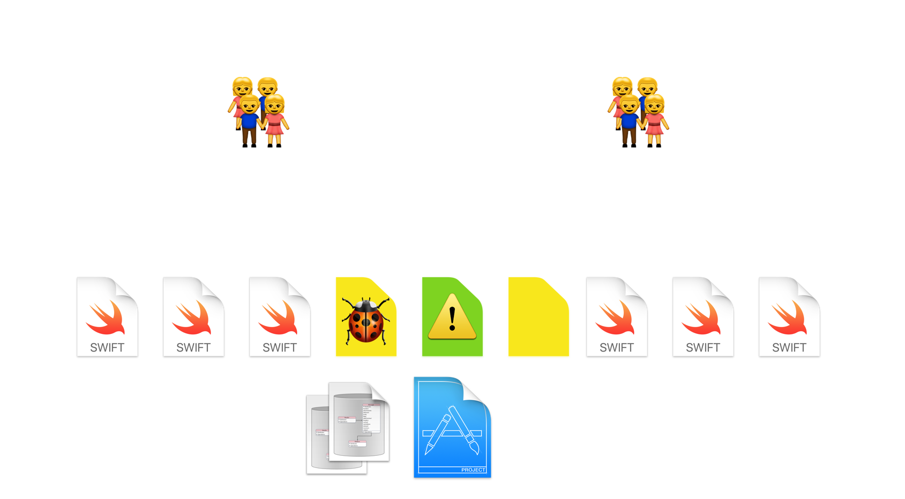

---


---

# 😰


---

# 🤔

---

## Framework
## Oriented
## Programming


---

# Architectural Approach

Modularizing your apps code bases in *local* and _multiplatform_ frameworks that expose a _hookable_ interface.

---

### New platforms/targets
# _Gluing_

---


---

# Atomic teams
### that own frameworks

---

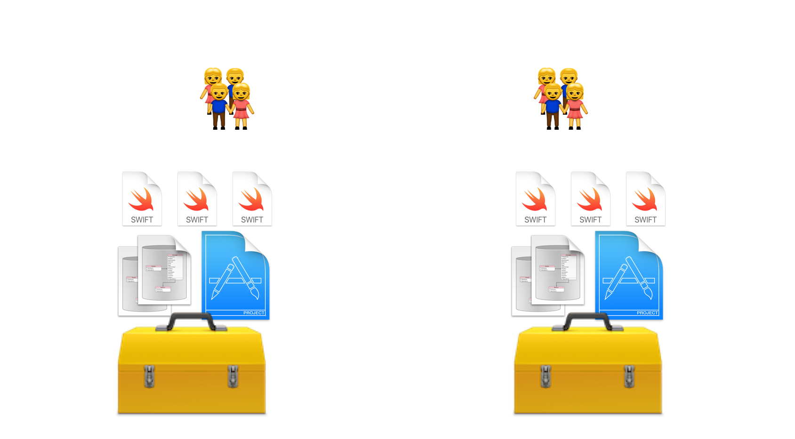

---

### Decide about persistence
### Decide about patterns
### Decide about architecture
### Decide about language

---

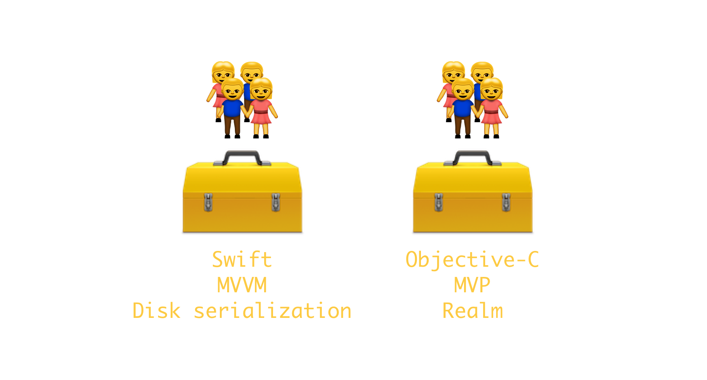

---

### Framework
## Exposes an API

---


---

### Fewer interdependencies
### Fewer conflicts
### Fewer bugs

---


---

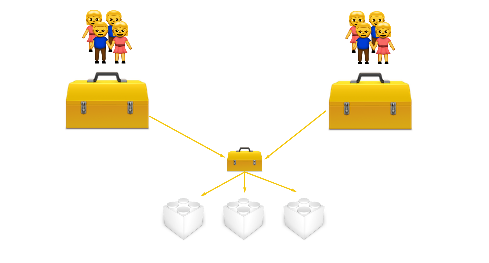

---

# _How to_
### _Setup the project_


---

# Using CocoaPods

### _Create pods_
### _Link the project against them_

---

```bash
mkdir Frameworks; cd Frameworks;
pod lib create Core
pod lib create UI
pod lib create Player
pod lib create Offline
```

---

```ruby
Pod::Spec.new do |s|
  s.name = 'Player'
  s.dependency 'Core'
  s.dependency 'UI'
end
```

---

```ruby
abstract_target 'Frameworks' do
  pod "Core", :path => "Frameworks/Core"
  pod "UI", :path => "Frameworks/UI"
  pod "Player", :path => "Frameworks/Player"
  pod "Offline", :path => "Frameworks/Offline"

  # Platforms
  target "MyApp"
  target "MyTVApp"
  target "MyWatchApp"
end
```

---

# Manually
### _Creating/Linking_

---

# Workspace
### Multiple framework projects
#### Linked/Embedded

---


---

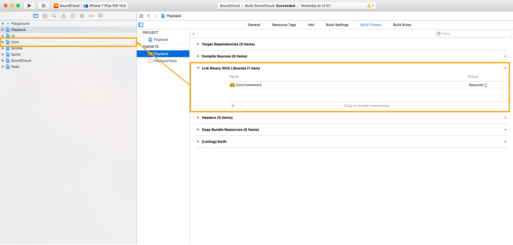

---


---

# Multi-Platform Framework

```bash
# Supported platforms
SUPPORTED_PLATFORMS = iphoneos iphonesimulator appletvsimulator appletvos macosx watchsimulator watchos

# Valid architectures
VALID_ARCHS[sdk=macosx*] = x86_64
VALID_ARCHS[sdk=iphone*] = arm64 armv7 armv7s

# Frameworks Search Path
LD_RUNPATH_SEARCH_PATHS[sdk=iphone*] = $(inherited) @executable_path/Frameworks @loader_path/Frameworks
LD_RUNPATH_SEARCH_PATHS[sdk=macosx*] = $(inherited) @executable_path/../Frameworks @loader_path/../Frameworks
LD_RUNPATH_SEARCH_PATHS[sdk=watch*]   = $(inherited) @executable_path/Frameworks @loader_path/Frameworks
LD_RUNPATH_SEARCH_PATHS[sdk=appletv*] = $(inherited) @executable_path/Frameworks @loader_path/Frameworks
```

---


---

# Pandora
### [github.com/frameworkoriented/pandora](https://github.com/frameworkoriented/pandora)

```bash
gem install pandora-frameworks
pandora create Core org.myorg
```


---

# _Questions_
### _With answers_


---

# External dependencies?

- Minimize them (DIY)
- Most dependent framework, fewer dependencies.

---

# CocoaPods/Carthage?
- Up to you
- Both support local/external dependencies.
- Depends on your setup.

---

# Static/Dyamic?
- Linking:
  - Static: *Compilation time.*
  - Dynamic: *Startup time.*
- Swift only supports dynamic.

---

# Linking/Embedding?

- *Linking* "connects" dependencies.
- *Embedding* "copies" them to the target (app)

---

# Analyze
## Existing tools (e.g. CocoaPods)

- Reverse engineering.

---

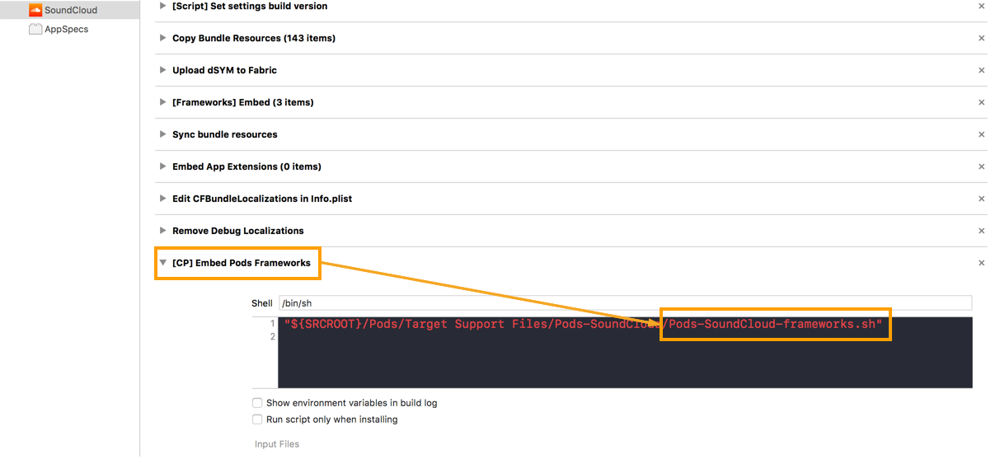

---

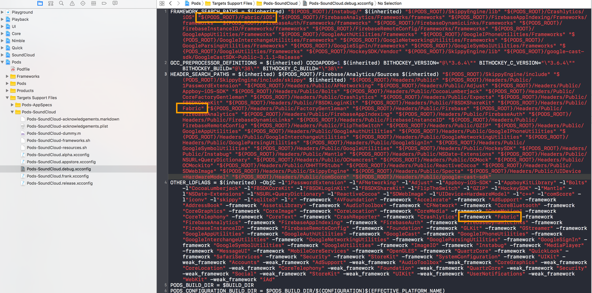

---

# Transitioning from Monolithic?

- Start pulling tooling:
  - API client.
  - Database wrapper.
  - Analytics.
  - Logging
- Continue gradually pulling features from the _least dependent_.

---

# How many frameworks?
- It depends on your setup
- Find the _stack_ that works for you.

---

# Freelance Setup

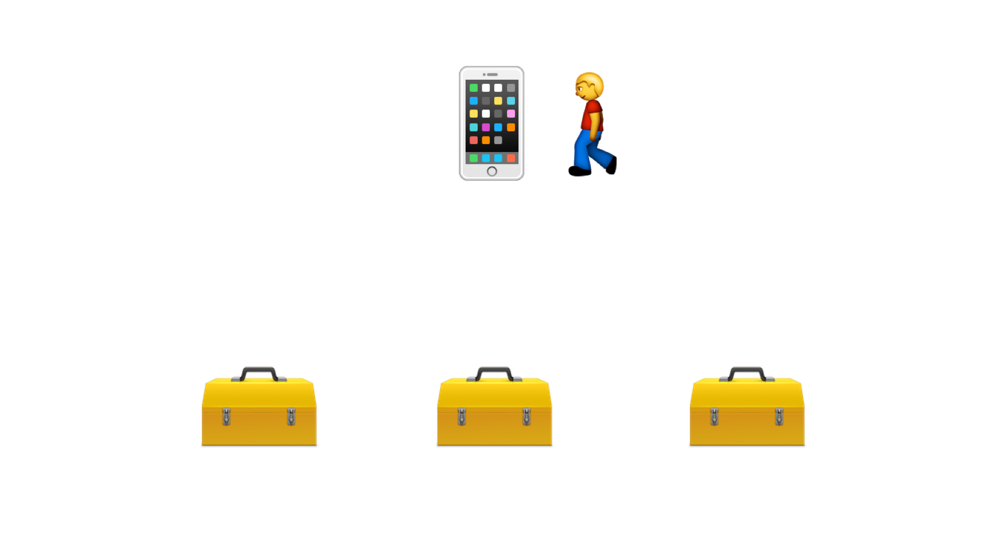

---

# Feature Teams Setup


---

# Multi-Platform Setup

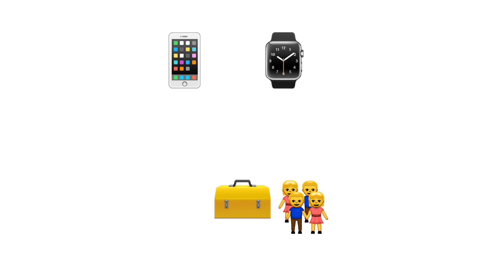

---

# One/Multiple repositories?

- *One repository*
- *Unless*:
  - Other repository needs a framework.
  - You make a framework open source.

---

# Versioning?

- *Unified* versioning.
- *Unless* different repositories.
- *Very useful:* deprecation macros.

---

# Public/Internal/Private?
- *Internal* by default.
- *Public* API.
- *Restrictive* over permissive.
- *Enforce* good practices.

---

# Downsides


---

# Documentation
### _Not good enough_

---

## _No homogeneity_
# In APIs

---

# Macros

```swift
#if !os(macOS)
  import AppKit
  typealias Image = NSImage
#else
  import UIKit
  typealias Image = UIImage
#end
```

---

# Xcode
#### Has a long way to go
### 🙏 :apple:

^ Error forwarding
^ Frameworks recompilation

---

# Conclussions

- Fewer conflicts in big teams.
- Easy multiplatfom apps.
- Aims good practices (API).

## Do it if only if your project needs it

---

# References

- [frameworkoriented.io](frameworkoriented.io)
- [Building Modern Frameworks](https://developer.apple.com/videos/play/wwdc2014/416/)
- [How to create a Framework for iOS](https://www.raywenderlich.com/65964/create-a-framework-for-ios)
- [Framework vs Library](http://www.knowstack.com/framework-vs-library-cocoa-ios/)
- [Static and Dynamic libraries](https://pewpewthespells.com/blog/static_and_dynamic_libraries.html)
- [The Unofficial Guide to xcconfig files](https://pewpewthespells.com/blog/xcconfig_guide.html)

---

# Thanks
## _Questions?_
### #yatusabes 🍷
#### _@pepibumur / pepibumur@gmail.com_


##### _Photos from_ [_Unsplash_](https://unsplash.com)
#### _Slides_ [_bit.ly/frameworkoriented_](http://bit.ly/frameworkorientedprogramming)

---
